# Remote developers earn 51% more. Here's what 65,000 developers revealed.

### Stack Overflow Developer Survey 2024 — Analytics Deep Dive

<p align="center">
  <a href="https://www.python.org/"></a>
  <a href="https://duckdb.org/"></a>
  <a href="https://streamlit.io/"></a>
  <a href="https://plotly.com/"></a>
  <a href=".github/workflows/smoke.yml"></a>
  <a href="https://4cmjubresrab8nk6zhjqbv.streamlit.app/"></a>
</p>

**[Live Demo → Streamlit Cloud](https://4cmjubresrab8nk6zhjqbv.streamlit.app/)**

---

63,023 valid responses. 20 analytical SQL queries. 6 dashboard sections.  
One dataset that reveals what the tech industry actually looks like in 2024.

---

## Key Findings

| # | Finding | Data |
|---|---------|------|
| 1 | Remote developers earn **51% more** than in-person | $83k vs $55k median |
| 2 | **SQL is used by 69%** of data professionals | Most universal data skill |
| 3 | **Python dominates** data roles — R is irrelevant | 82% vs 20% adoption |
| 4 | **Hybrid is the new normal** — office-only is dying | 42.5% hybrid · only 19.6% in-person |
| 5 | Senior devs (20+ yrs) go remote at **2× the rate** of juniors | 46% vs 24% |
| 6 | **PostgreSQL overtook MySQL** as #1 database | 24.4k vs 19.9k users |

---

## Screenshots

<details>
<summary>📊 Hero & KPI Row</summary>

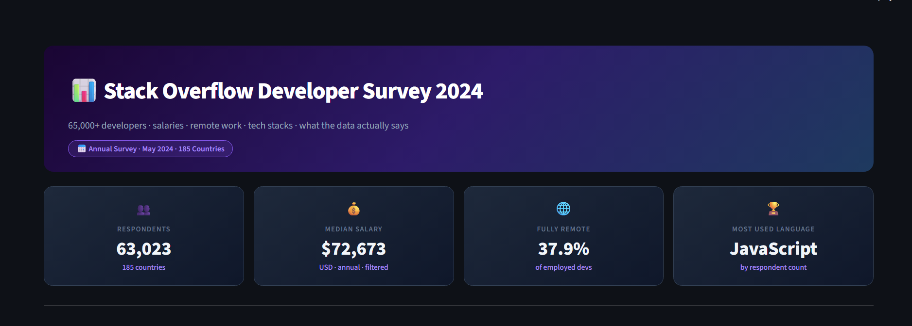

</details>

<details>
<summary>🔍 Key Findings — 6 Data-Driven Insights</summary>

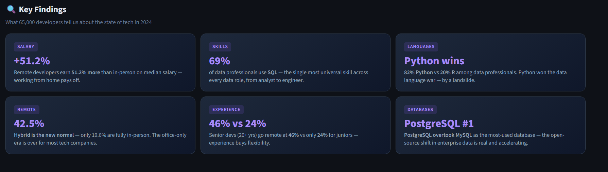

</details>

<details>
<summary>💰 Salary by Programming Language</summary>

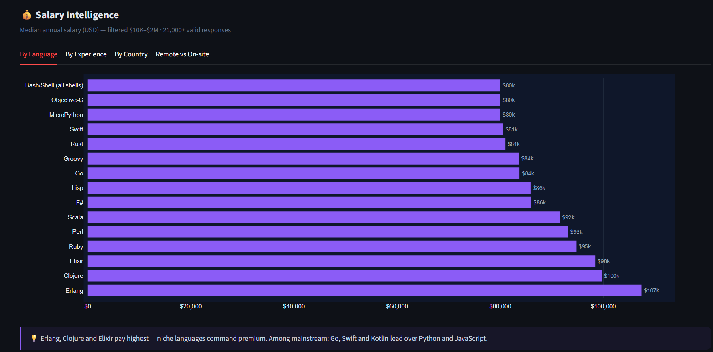

</details>

<details>
<summary>📈 Salary by Experience Level</summary>

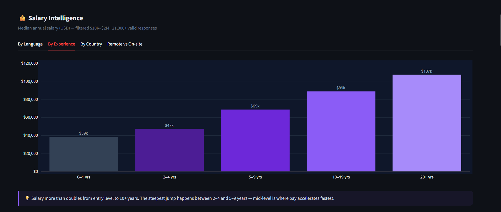

</details>

<details>
<summary>🌍 Salary by Country — Geographic Pay Gap</summary>

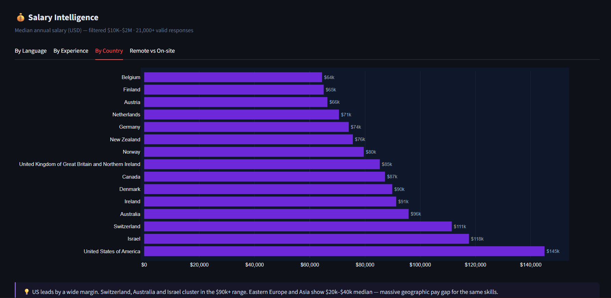

</details>

<details>
<summary>🏠 Remote vs On-site Salary Comparison</summary>

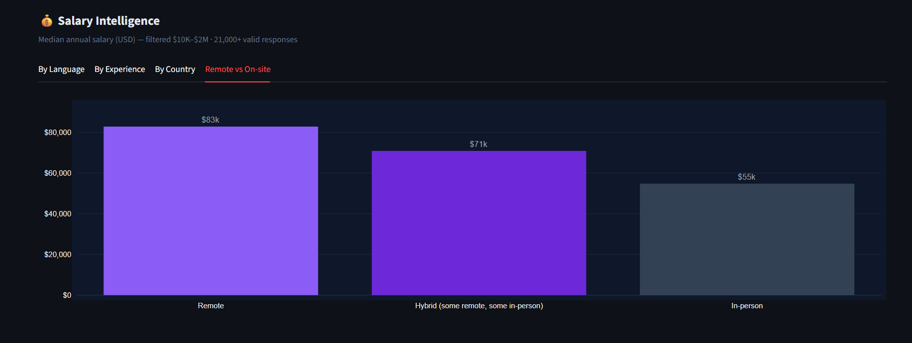

</details>

<details>
<summary>🛠️ Tech Stack Rankings — Languages & Databases</summary>

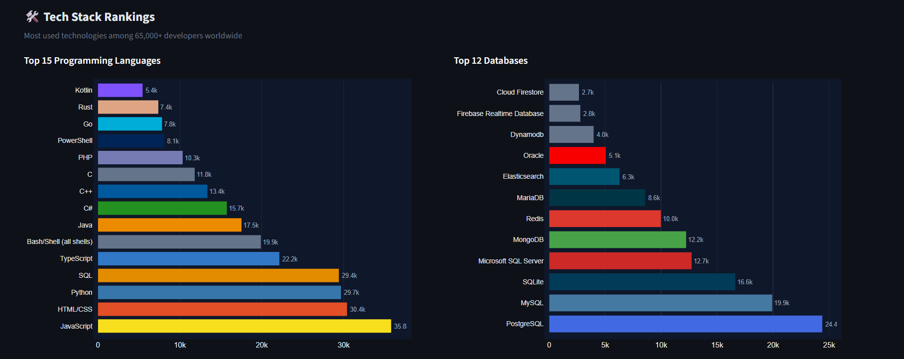

</details>

<details>
<summary>☁️ Top Cloud Platforms</summary>

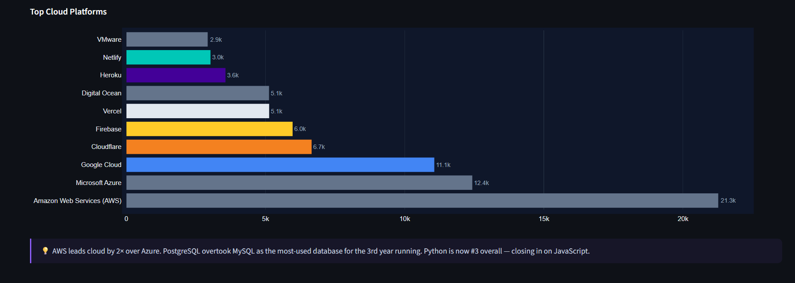

</details>

<details>
<summary>🌐 Remote Work Trends</summary>

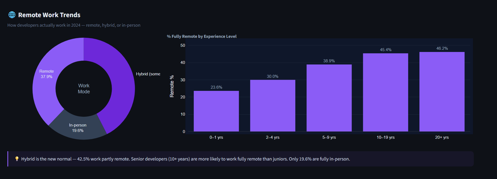

</details>

<details>
<summary>👤 Developer Profile</summary>

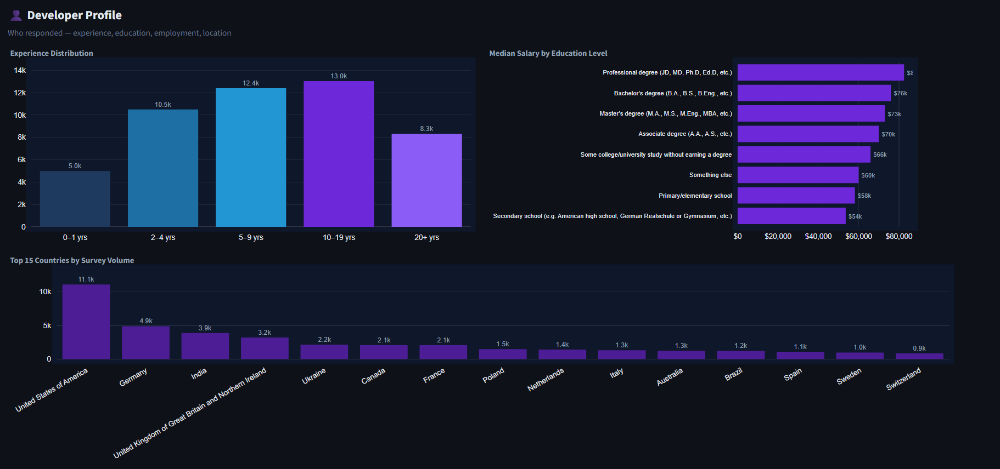

</details>

<details>
<summary>🎯 Data Roles Focus — SQL · Python · R · Salaries</summary>

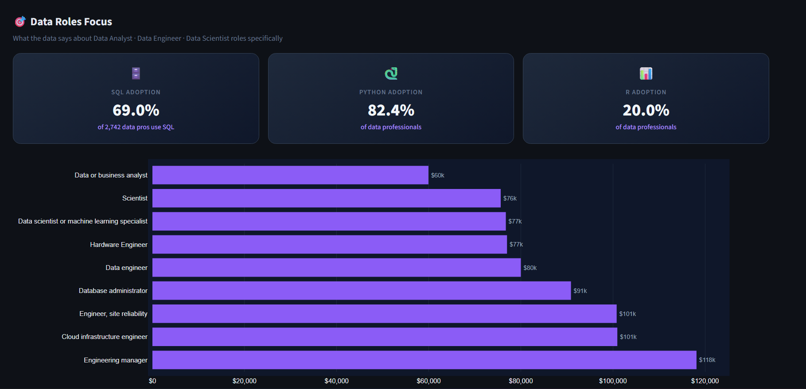

</details>

<details>
<summary>🤖 AI Tool Adoption Among Developers</summary>

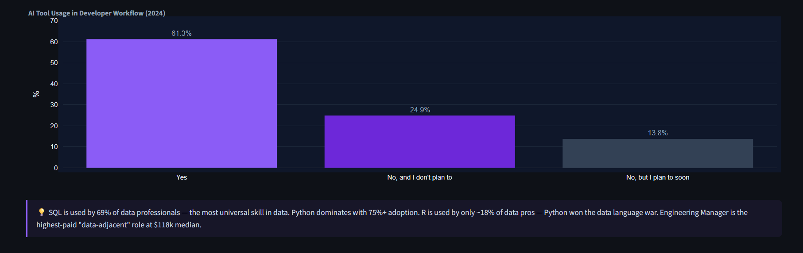

</details>

---

## At a Glance

| Metric | Value |
|--------|-------|
| Survey responses | **65,437** (63,023 after salary filtering) |
| Countries represented | **185** |
| Salary data points | **21,021** (filtered $10K–$2M) |
| Median developer salary | **$72,673 USD** |
| Fully remote developers | **37.9%** |
| Most used language | **JavaScript** (35.8k users) |
| Most used database | **PostgreSQL** (24.4k users) |
| Top cloud platform | **AWS** (21.3k users) |
| SQL queries | **20 analytical queries** |
| Dashboard sections | **6** |
| CI/CD checks | **23 smoke tests — all passing** |

---

## SQL Showcase

This project is a SQL-first analytics project — every chart is powered by a query with real business logic.

### Salary by Language — Window Function + Aggregation

```sql
SELECT
    TRIM(lang)                          AS language,
    ROUND(MEDIAN(salary_usd))           AS median_salary,
    COUNT(*)                            AS respondents
FROM survey,
     UNNEST(STRING_SPLIT(LanguageHaveWorkedWith, ';')) AS t(lang)
WHERE salary_usd IS NOT NULL
  AND LanguageHaveWorkedWith IS NOT NULL
GROUP BY language
HAVING COUNT(*) >= 200
ORDER BY median_salary DESC
LIMIT 15
```

### Remote Premium — Conditional Aggregation

```sql
SELECT
    RemoteWork,
    ROUND(MEDIAN(salary_usd))   AS median_salary,
    ROUND(AVG(salary_usd))      AS mean_salary,
    COUNT(*)                    AS respondents
FROM survey
WHERE salary_usd IS NOT NULL
  AND RemoteWork IS NOT NULL
GROUP BY RemoteWork
ORDER BY median_salary DESC
```

### Experience × Remote Rate — FILTER Clause

```sql
SELECT
    CASE
        WHEN YearsCodePro < 2  THEN '0-1 yrs'
        WHEN YearsCodePro < 5  THEN '2-4 yrs'
        WHEN YearsCodePro < 10 THEN '5-9 yrs'
        WHEN YearsCodePro < 20 THEN '10-19 yrs'
        ELSE '20+ yrs'
    END AS exp_bucket,
    ROUND(
        COUNT(*) FILTER (WHERE RemoteWork = 'Remote') * 100.0 / COUNT(*), 1
    ) AS remote_pct
FROM survey
WHERE RemoteWork IS NOT NULL AND YearsCodePro IS NOT NULL
GROUP BY exp_bucket
ORDER BY MEDIAN(YearsCodePro)
```

### SQL Adoption Among Data Professionals — Subquery + UNNEST

```sql
WITH data_folks AS (
    SELECT ResponseId, LanguageHaveWorkedWith
    FROM survey,
         UNNEST(STRING_SPLIT(DevType, ';')) AS t(role)
    WHERE LOWER(role) LIKE '%data%'
)
SELECT
    COUNT(*) AS total_data_pros,
    COUNT(*) FILTER (WHERE LanguageHaveWorkedWith LIKE '%SQL%') AS use_sql,
    ROUND(
        COUNT(*) FILTER (WHERE LanguageHaveWorkedWith LIKE '%SQL%')
        * 100.0 / COUNT(*), 1
    ) AS sql_pct
FROM data_folks
```

---

## Architecture

```
Stack Overflow Annual Survey 2024 (Kaggle CSV · 65K rows)
        |
        v  src/load_data.py
   DuckDB — survey table (63K rows after salary filter)
        |
        v  src/queries.py — 20 analytical SQL queries
   Query layer (KPIs · Salary · Stack · Remote · Profile · DA/DE)
        |
        v  scripts/upload_db.py
   HuggingFace Dataset (evgeniimatveevusa/so-survey-db · ~3.4 MB)
        |
        v  dashboard/app.py — auto-download on cold start
   Streamlit + Plotly — 6-section dashboard
        |
   Streamlit Community Cloud (always-on)
        |
   GitHub Actions — smoke.yml
   23 SQL checks on every push
```

**Key design decision:** DuckDB binary (~3.4 MB) lives on a HuggingFace Dataset. The dashboard downloads it on startup — zero database hosting cost, instant cold start.

---

## Data Pipeline

```python
# 1. Load & clean (src/load_data.py)
df = pd.read_csv("data/survey_results_public.csv", usecols=KEEP_COLS)
df["salary_usd"] = pd.to_numeric(df["ConvertedCompYearly"], errors="coerce")
df = df[(df["salary_usd"] >= 10_000) & (df["salary_usd"] <= 2_000_000)]
# Result: 63,023 rows · 20 columns

# 2. Load into DuckDB
conn.execute("CREATE TABLE survey AS SELECT * FROM df")

# 3. Upload to HuggingFace Dataset
api.upload_file(path_or_fileobj="data/survey.duckdb", ...)
```

Salary outliers removed: 2,414 rows (implausible values like $0, $1B, etc.)

---

## CI/CD — 23 Smoke Tests on Every Push

```yaml
on:
  push:
    branches: [master]
  pull_request:
    branches: [master]
  workflow_dispatch:        # manual trigger from GitHub UI
```

Every push triggers 23 assertions — verifying every SQL query returns valid, non-empty results:

```
PASS  kpi_total_responses    PASS  top_languages
PASS  kpi_median_salary      PASS  top_databases
PASS  kpi_remote_pct         PASS  top_cloud_platforms
PASS  salary_by_language     PASS  remote_by_country
PASS  salary_by_experience   PASS  remote_by_experience
PASS  salary_by_country      PASS  remote_distribution
PASS  salary_remote_onsite   PASS  experience_dist
PASS  salary_by_org_size     PASS  education_vs_salary
PASS  language_salary_hmap   PASS  data_roles_salary
PASS  remote_by_country      PASS  sql_usage_rate
PASS  top_countries_volume   PASS  python_vs_r
                             PASS  ai_tool_adoption
23/23 checks passed
```

---

## Tech Stack

| Layer | Tool |
|-------|------|
| Data source | Stack Overflow Annual Developer Survey 2024 |
| SQL engine | DuckDB 1.5.3 (in-process, zero config) |
| Data processing | Python · pandas |
| Dashboard | Streamlit + Plotly |
| DB storage | HuggingFace Dataset (binary file, auto-downloaded) |
| CI/CD | GitHub Actions (smoke tests · Node.js 24) |
| Deployment | Streamlit Community Cloud |

---

## Quick Start

```bash
git clone https://github.com/evgeniimatveev/so-survey-analytics.git
cd so-survey-analytics
pip install -r requirements.txt

# Download survey CSV from Kaggle:
# "Stack Overflow Annual Developer Survey 2024"
# Place as: data/survey_results_public.csv

python src/load_data.py           # CSV → DuckDB
python scripts/smoke_test.py      # verify all 23 queries
streamlit run dashboard/app.py    # launch locally
```

---

## Project Structure

```
so-survey-analytics/
├── src/
│   ├── load_data.py      # CSV → DuckDB (salary filter, type coercion)
│   └── queries.py        # 20 analytical SQL queries
├── dashboard/
│   └── app.py            # Streamlit — 6 sections + Key Findings
├── scripts/
│   ├── upload_db.py      # DuckDB → HuggingFace Dataset
│   ├── download_db.py    # HuggingFace Dataset → DuckDB
│   └── smoke_test.py     # 23 assertions
├── .github/
│   └── workflows/
│       └── smoke.yml     # CI/CD — Node.js 24
├── requirements.txt
├── runtime.txt           # python-3.11
└── .gitignore            # data/ excluded — DB lives on HuggingFace
```

---

*Data: Stack Overflow Annual Developer Survey 2024 · 185 countries · 65,437 responses · Built by [Evgenii Matveev](https://github.com/evgeniimatveev)*
